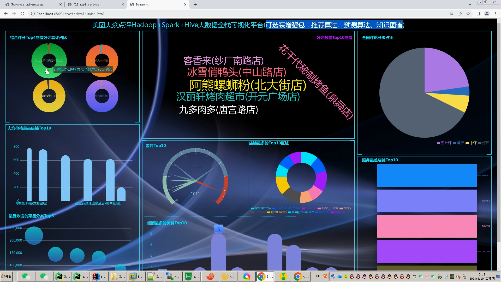
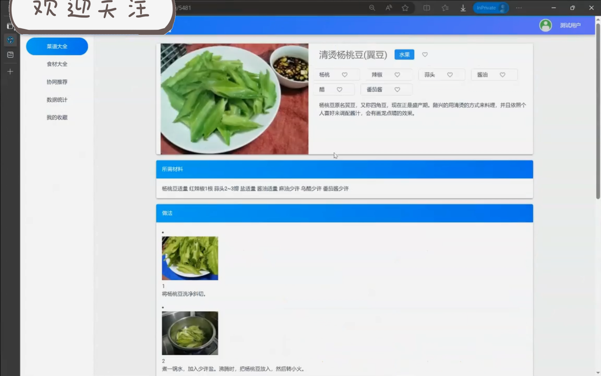
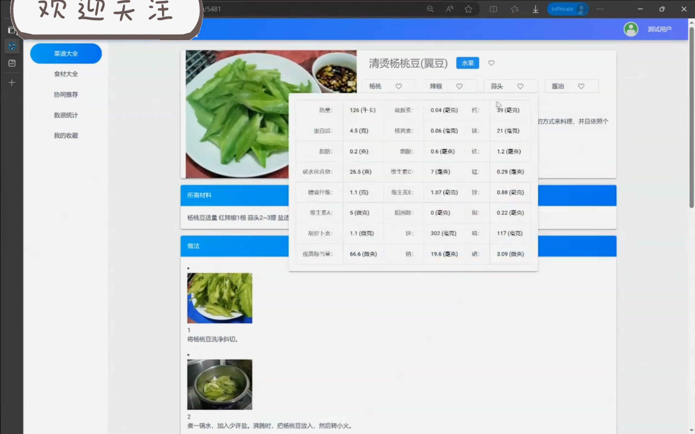
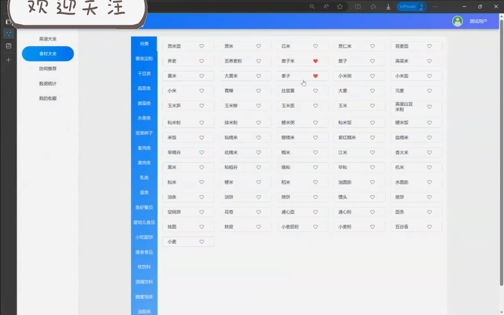
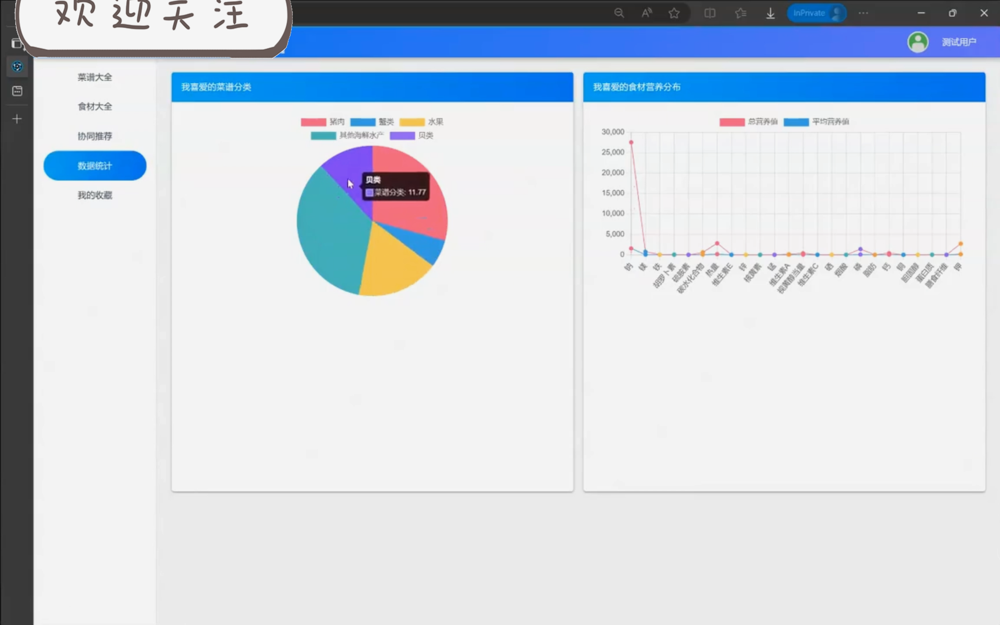
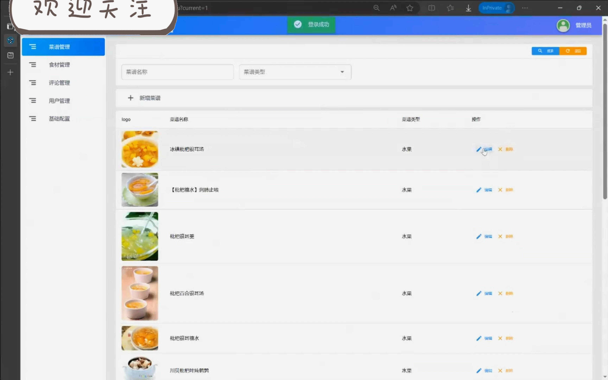
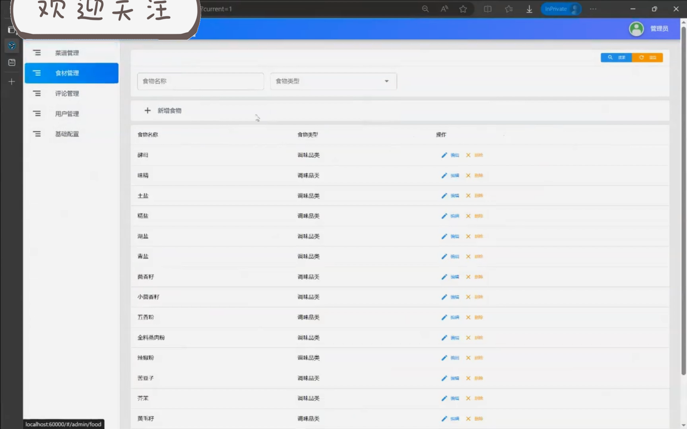

## 计算机毕业设计Spark+SpringBoot健康食谱推荐系统 健康饮食推荐系统 Hadoop Python爬虫 数据可视化 机器学习 深度学习 推荐算法 大数据毕业设计

## 要求
### 源码有偿！一套(论文 PPT 源码+sql脚本+教程)

### 
### 加好友前帮忙start一下，并备注github健康食谱推荐
### 我的QQ号是2827724252或者798059319或者 1679232425或者微信:bysj2023nb

# 

### 加qq好友说明（被部分 网友整得心力交瘁）：
    1.加好友务必按照格式备注
    2.避免浪费各自的时间！
    3.当“客服”不容易，repo 主是体面人，不爆粗，性格好，文明人。

## 功能
功能包括食谱推荐，食谱浏览，评论，收藏，评分，食谱管理，用户管理，评分管理，评论管理等

## 演示视频
https://www.bilibili.com/video/BV1wQzCYvEr4/?spm_id_from=333.999.0.0

## 运行界面截图

